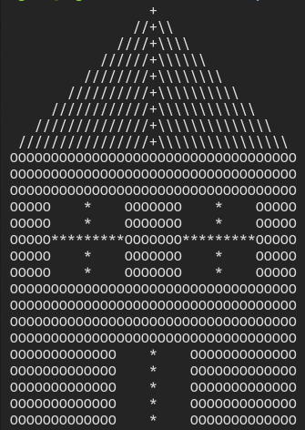

# Draw a House
[](https://www.codacy.com/manual/orhantgrl/draw-a-house?utm_source=github.com&amp;utm_medium=referral&amp;utm_content=orhantgrl/draw-a-house&amp;utm_campaign=Badge_Grade)

All its does is draw a beautiful house with the entered values :)

## Output
Input : 35



## Run

```bash
git clone https://github.com/orhantgrl/draw-a-house.git
cd draw-a-house/cmake-build-debug
./draw_a_house
```
